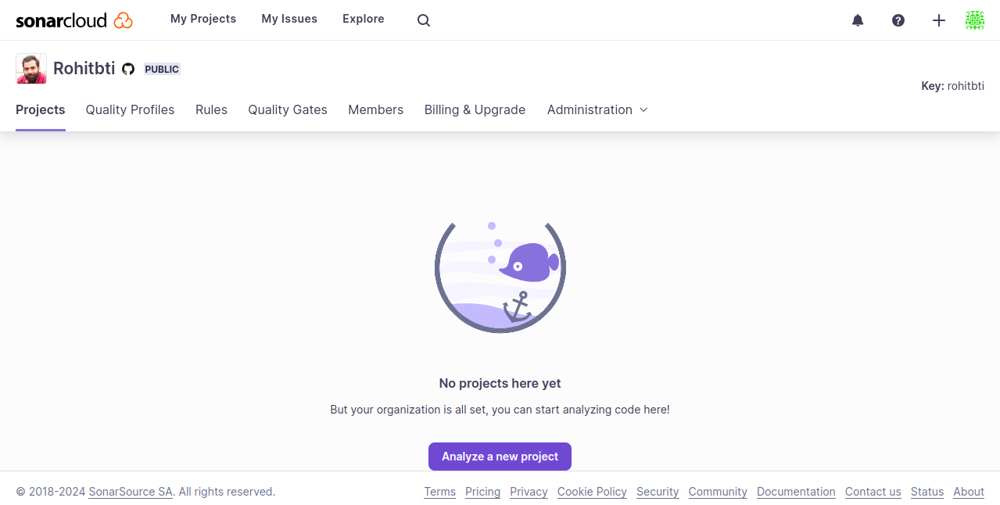

# Integrating SonarCloud with Django Project

Integrating SonarCloud into your project involves several steps to enable continuous code quality analysis. SonarCloud is a cloud-based platform that provides static code analysis to help identify and fix code quality issues. Here are the basic steps to integrate SonarCloud into your Django project.

## Steps to Integrate SonarCloud

### 1. Clone the Repository

#### 1.1 clone the repository to get started:

```
git clone https://github.com/Rohitbti/sonar-analysis.git
```

### 2. Create a SonarCloud Account

Create an account on SonarCloud or log in directly with your GitHub account use below link to login.

`https://sonarcloud.io/login`

#### 2.1: Set Up Your SonarCloud Account
Follow below steps to set up your SonarCloud account:


#### 2.2: Authorize your GitHub account with Sonar.


Import the organization and select the repository you want to work with.
After creating your organization, you will see a dashboard.



Click on "Analyze a new project," select your repository, and set up the configuration.

In the SonarCloud dashboard, select the analysis method - choose "with GitHub Action."


Copy the Sonar token provided.

### 3. Configure GitHub Secrets
Go to your GitHub repository and navigate to `Settings > Secrets > Actions`. Create two keys: `SONAR_TOKEN` and `GITHUB_TOKEN`. Paste the Sonar token and GitHub secret token, respectively.


### 4. Create GitHub Workflow
Create a GitHub Actions workflow file named `.github/workflows/build.yml` in your project. Copy the code provided by SonarCloud for Python.


### 5. Create Sonar Project Properties File
Create a `sonar-project.properties` file in the project root and paste the code provided by SonarCloud.


### 6. Commit and Push Changes
Commit the `.github/workflows/build.yml` file and the `sonar-project.properties` file. Push the changes to your repository.

### Note: ###
*The sonar-project.properties file stores the project key, project name, and other configurations. You can include additional configurations, such as excluding specific test cases.*

### 7. Monitor Workflow Execution
Go to the `"Actions"` tab on your GitHub repository to monitor the execution of the SonarCloud workflow.

### 8. View Results on SonarCloud
After the workflow completes, visit your SonarCloud dashboard to view the analysis results.


### Additional Information

The `sonar-project.properties` file is utilized to store the project key, project name, and other configurations. You can include extra configurations, such as excluding specific test case scenarios from your project. For instance, if you prefer not to include code coverage for a particular file or application, you can define it here, and SonarCloud will exclude that specific application.